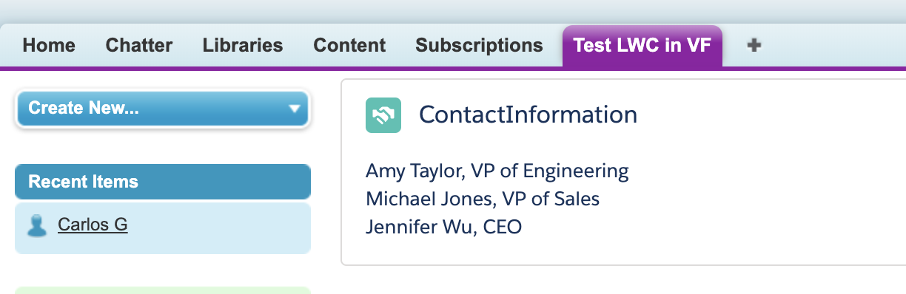

# LWC in VisualForce Page (Org without custom domain)

Small POC with a LWC inside a Lightning app embedded in a VisualForce page. 
[This POC is based on Salesforce official documentation.](https://developer.salesforce.com/docs/atlas.en-us.lightning.meta/lightning/components_visualforce.htm)

## Metadata used
* Lightning App (LwcVfApp)
* Lightning Web Component (myFirstWebComponent)
* VisualForce Page (LwcVisualForce)
* VisualForce Tab (Test LWC in VF)

### Lightning Web Component

    myFirstWebComponent

First of all we create a LWC to show contact information

### Lightning App

    LwcVfApp.app

We create a Lightning App as our LWC container. This app has to be configured as follows: 

     <aura:application access="GLOBAL" extends="ltng:outApp"> 
        <aura:dependency resource="c:myFirstWebComponent"/>
    </aura:application>

It means, the app es **globally accessible** and extends from **ltng:outApp**. Also declares dependencies of any component to be used. (This example has one, but could be more).

### VisualForce Page 

    LwcVisualForce

The VisualForce page is the container that will allow the LWC to be shown in **classic** and within an org **without a custom domain** due to VisualForce pages **runs in their own custom domain**. 

In the VF you need to include the following tag so, the VF recognizes LWC markup.

    <apex:includeLightning />

Finally, add your top-level component to a page using ** *$Lightning.createComponent(String type, Object attributes, String domLocator, function callback)* **. This function is similar to *$A.createComponent()*, but includes an additional parameter, **domLocator**, which specifies the DOM element where you want the component inserted.

### VisualForce Tab 
    Test LWC in VF

It is only to put it in the navigation bar
